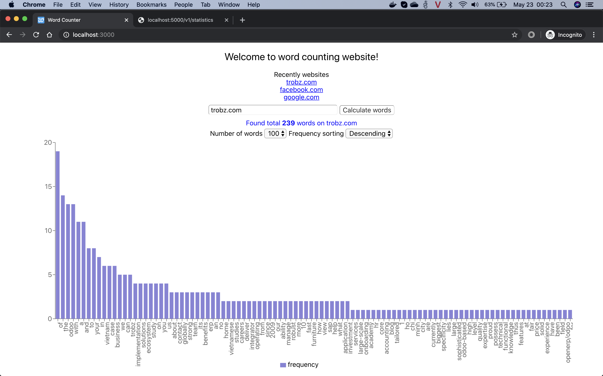
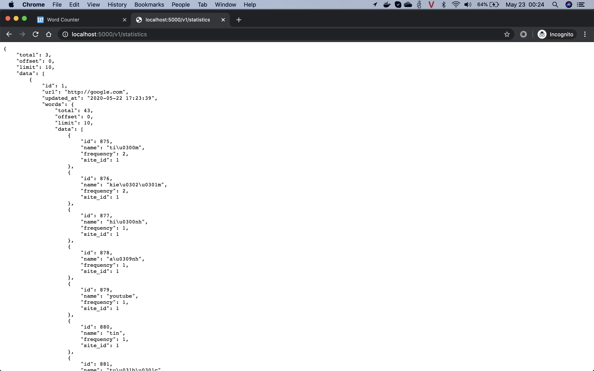

# Word Counter

The statistic about the frequency of words on a website.

## Project Stacks

* Database: SQLite
    * ORM: Flask-SQLAlchemy

* Backend Framework: Flask
    * Library: Flask-RESTful

* Frontend Framework: React
    * Chart library: recharts

* Programming Language: Python

## Database Design

* Schema:
    * `site`: Store website information
        * `url`
        * `updated_at`
        * `words` -> One2Many (`word`)

    * `word`: Store statistic information
        * `name`
        * `frequency`
        * `site_id` -> Many2One (`site`)

* Tables:

    | id   | url                | updated_at                 |
    | --   | ---                | ----------                 |
    | 1    | http://google.com  | 2020-05-22T17:48:18.222434 |

    | id   | name     | frequency | site_id |
    | --   | ----     | --------- | ------- |
    | 1    | search   | 2         | 1       |
    | 2    | feeling  | 1         | 1       |
    | 3    | lucky    | 1         | 1       |
    | 4    | about    | 1         | 1       |
    | ...  | ...      | ...       | ...     |

## API Specification

### Resources

* `statistics`

### Routes

* `/v1/statistics`
    * Methods: GET, POST

* `/v1/statistics/<int:statistic_id>`
    * Methods: GET, PUT, DELETE

### Pagination

* `DEFAULT_PAGINATION_LIMIT` = 10 <`./backend/utils/misc.py`>
    * Example:
        ```
        GET /v1/statistics
        ```

        ```javascript
            {
                <!-- MAXIMUM 10 RECORDS -->
                "total": 1,
                "offset": 0,
                "limit": 10,
                "data": [
                    {
                        "id": 1,
                        "url": "http://google.com",
                        "updated_at": "2020-05-22 15:52:00",
                        "words": {
                            <!-- MAXIMUM 10 RECORDS -->
                            "total": 43,
                            "offset": 0,
                            "limit": 10,
                            "data": [
                                {
                                    "id": 1,
                                    "name": "search",
                                    "frequency": 2,
                                    "site_id": 1
                                },
                                {
                                    "id": 2,
                                    "name": "feeling",
                                    "frequency": 1,
                                    "site_id": 1
                                },
                                ...
                                ...
                                ...
                            ]
                        }
                    }
                ]
            }
        ```

### API Workflows

* GET statistics
    * For a specific website
        ```
        GET /v1/statistics/<statistic_id>?order=-frequency&offset=0&limit=100
        ```
        ```
        GET /v1/statistics/<statistic_id>?order=+frequency&offset=0&limit=20
        ```

    * For all websites
        ```
        GET /v1/statistics
        ```
        ```
        GET /v1/statistics?order=-frequency&offset=0&limit=100
        ```

* Calculate words from a specific website
    ```
    POST /v1/statistics {"website_url": "http://google.com"}
    ```

* Recalculate words again
    ```
    PUT /v1/statistics/<statistic_id>
    ```

* Delete statistic
    ```
    DELETE /v1/statistics/<statistic_id>
    ```

## Client app features

* Input website URL and calculate words
* Render the statistics with BarChart view
* Filter number of words, sorting the frequency
* View recently calculated websites

## Development Guide

### Setup (without Docker)

* Environments:
    - Node: 14.2.0
    - Python: 3.7

* Install virtual library
    ```bash
    $ pip install virtualenv
    $ pip3 install virtualenvwrapper
    ```

* Setup virtual environment
    ```bash
    $ cd fullstack-developer-challenge
    $ mkvirtualenv word_counter
    ```

* Install packages
    ```bash
    $ pip install -r backend/requirements.txt
    ```

* Run the tests
    ```bash
    $ cd backend
    $ python -m unittest -v
    ```

* Export variables
    ```bash
    $ export FLASK_APP=flaskr.py
    $ export FLASK_CONFIG_ENVIRONMENT=config.DevelopmentConfig
    ```

* Run backend application
    ```bash
    $ python flaskr.py
    ```

* Install packages
    ```bash
    $ cd ../client
    $ npm install
    ```

* Config variables
    ```bash
    $ cp .env.sample .env
    ```
    * Recheck `REACT_APP_SERVER_URL`

* Run frontend application
    ```bash
    $ npm start
    ```

### Setup (with Docker)

* Environments:
    * Operating System: MacOS Catalina 10.15.4
    * Docker Engine - Community: 19.03.8
    * Docker Compose: 1.24.0

* View the logs
    ```bash
    $ cd fullstack-developer-challenge
    $ docker-compose logs -f
    ```

* Build images:
    ```bash
    $ docker-compose build
    ```

* Run services as deamon:
    ```bash
    $ docker-compose up -d
    ```

* Access services via browser:
    - Flask RESTful: http://localhost:5000/
    - React App: http://localhost:3000/ (might take a bit time for first load)

* Docker build references:
    - `./docker-compose.yml`
    - `./backend/Dockerfile`
    - `./client/Dockerfile`

## Screenshots





## References

* [Flask](https://flask.palletsprojects.com/)
* [Flask RESTful](https://flask-restful.readthedocs.io/)
* [Flask SQLAlchemy](https://flask-sqlalchemy.palletsprojects.com/)
* [React](https://reactjs.org/)
* [Recharts](http://recharts.org/)
* [Docker](https://www.docker.com/)
